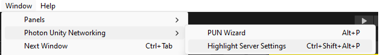
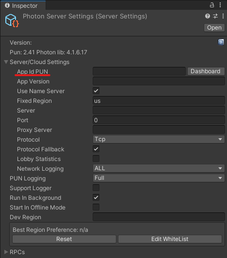
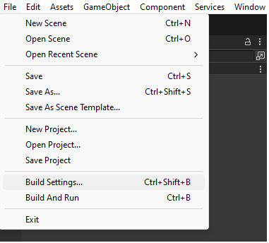
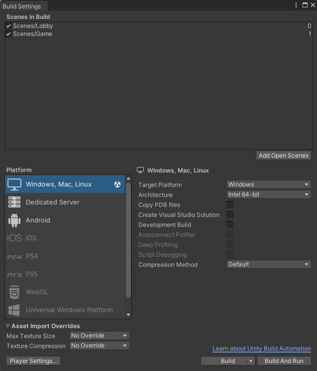
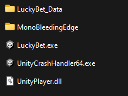

Unity version 2022.3.14f1

**Lucky Bet**

**Unity | C# | Multiplayer | Networking | Photon**

**Lucky Bet** is a multiplayer game for 2 players. Each player bets 10 chips on one of 2 colors. The game selects the winning color randomly. The player who chose the correct color, gets all the placed chips. The game goes on until one of the players has all the opponent's chips.

- A great example of a multiplayer game using Photon
- Clean architecture
- Sending complex objects through network
- Customizable game settings using Scriptable Objects

***

**How to set up Photon and run the game**

[First, you need to obtain a Photon app id. Click here to navigate to the instruction.](https://doc.photonengine.com/chat/current/getting-started/obtain-your-app-id) 

Once you have it, find Photon server settings. You can find that using the "Window/Photon Unity Networking/ Highlight Server Settings" menu option.

Now paste your app id into the "App Id PUN" field in the inspector.

This is a multiplayer game. So you'll need to run 2 instances. Now you can build it, share it with your friend and play together! You can also run 2 instances locally and play with yourself.

Let's build the app. Navigate to the build settings.

Now make sure both scenes are added in the build settings window. Then click build.

Now you have a multiplayer game that you can share with your friends!

